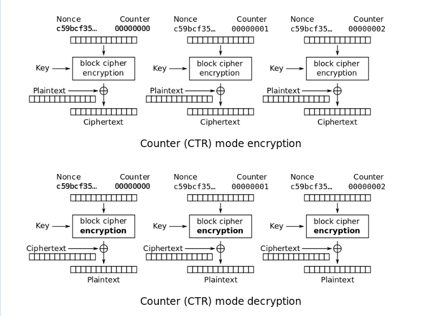

# WannaGame_Championship

## AES

```python
import os
from Crypto.Cipher import AES
from Crypto.Util import Counter

key = os.urandom(16)
iv = os.urandom(16)

def encrypt(key, iv, plaintext):
	ctr = Counter.new(128, initial_value = int(iv.encode("hex"), 16))
	aes = AES.new(key, AES.MODE_CTR, counter = ctr)
	ciphertext = aes.encrypt(plaintext)
	return ciphertext

hint = open("hint.txt", "r").read()
flag = open("flag.txt", "r").read()

print "i will give you a hint:", hint
# i will give you a hint: https://en.wikipedia.org/wiki/Block_cipher_mode_of_operation

print encrypt(key, iv, hint).encode("hex")
# 070d05e12e6001c95c8524664ec16ca5a8a0f1569cdba7ca408326cb309daf3f38c0094167a792030a95feeacaa515365a58b91fa0716fdda044a42a
print encrypt(key, iv, flag).encode("hex")
# 18181fff3c3d4f8b5c903a2141cb35e2fda6ae0787d6e5c857952ec16a8389323293542d33f9d5595bd399b5c4a21350075a9b
```

Bài này sử dụng AES-128 mode CTR để tạo 1 stream cipher



Ta thấy mỗi lần encrypt thuật toán không tiếp tục tạo chuỗi stream cipher, mà lại bắt đầu tạo lại từ đầu. Như vậy nghĩa là các plain text  sẽ được xor với cùng 1 chuỗi ???
vì chúng ta đã có plain text và cipher text của 'hint', vậy nên ta có thể tìm được chuỗi stream cipher và lấy nó xor lại với cipher text của flag để lấy flag:

```python
hint = "https://en.wikipedia.org/wiki/Block_cipher_mode_of_operation"
cipherHint = bytes.fromhex('070d05e12e6001c95c8524664ec16ca5a8a0f1569cdba7ca408326cb309daf3f38c0094167a792030a95feeacaa515365a58b91fa0716fdda044a42a')

c = bytes.fromhex('18181fff3c3d4f8b5c903a2141cb35e2fda6ae0787d6e5c857952ec16a8389323293542d33f9d5595bd399b5c4a21350075a9b')
p = ''

for i in range(len(c)):
	p += chr(int(c[i])^int(cipherHint[i])^ord(hint[i]))
```

### flag: wannagame{00fa070b605b0e8aaa31dae06377724482acc92d}


## RSA1
```python
#/usr/bin/python2
from Crypto.Util.number import getPrime
import gmpy2

p = getPrime(1024)
q = getPrime(1024)
n = p*q
print n
# 19046128460580268124792418904439923628038380443228614265420753892208104167384699017880677209377989395759591201697416049286383805170787541508371508515718955340575523473825891740622486639297040981969651065677948514952134974296831008272261057223021343503211206743996697527180249217592723774774930021834627406433820336641830463392360823794688570988028821653274089530814733340477181869238461145402905191920439212888877192355189110608852253758670096831911199834500447101981710674975983733271018776412384571799375887748182868741531950257181923159967822037157631376933663317909176616732352195034753153046658158087075518071743

flag1 = open("flag1.txt", "r").read()
m1 = int(flag1.encode("hex"), 16)
e1 = 1572840401382569468846775838644864959820115464786082316205435501177464948896069977695576806151197942229295150118114329746275714634820239013512151181115838659843753236933751862822424246721512061620016115677332253038805317760297772593740667594440874673286411343455273269682959068299741244773950134363299303660437085638394927153304076489961105440193163696356770760898601459132669139268972614341313240819408991186498196955179787046690090111362440331326174662388864160477869133489143888243688568445847955557539131936453113752964986841705559145850625843267633705056895653900187431664871087050122151130232099694959966146559
c1 = pow(m1, e1, n)
print c1
# 15117416048092133274557453853729887542200128328930534843021285730677276284270
```

Ta có thể thấy bài này sử dụng n lớn, việc factor nó là điều không hợp lý. Thế nhưng tại sao nó lại sử dụng e lớn như thế??? với số e lớn, do 'ed ≡ 1 mod phi' nên khi e lớn thì d sẽ nhỏ.

Và mình nghĩ ngay tới [wiener's attack](https://en.wikipedia.org/wiki/Wiener%27s_attack) là một phương pháp để tìm d, trong điều kiện `d < 1/3 * N^(1/4)` . Các bạn có thể sử dụng [tool](https://github.com/pablocelayes/rsa-wiener-attack) này để tìm d theo phương pháp wiener's attack.
```
d = 16656927799163353877661715681598773131450887062970807023117168014424259242616105753626484669505496415330904982249092231332127999
```

### flag: wannagame{5a378bac7eb090bb86a5ce0042ce6542c0dd346f}

## RSA2
```python
#/usr/bin/python2
from Crypto.Util.number import getPrime
import gmpy2

p = getPrime(1024)
q = getPrime(1024)
n = p*q
print n
# 19046128460580268124792418904439923628038380443228614265420753892208104167384699017880677209377989395759591201697416049286383805170787541508371508515718955340575523473825891740622486639297040981969651065677948514952134974296831008272261057223021343503211206743996697527180249217592723774774930021834627406433820336641830463392360823794688570988028821653274089530814733340477181869238461145402905191920439212888877192355189110608852253758670096831911199834500447101981710674975983733271018776412384571799375887748182868741531950257181923159967822037157631376933663317909176616732352195034753153046658158087075518071743

flag2 = open("flag2.txt", "r").read()
m2 = int(flag2.encode("hex"), 16)
e2 = 65537
c2 = pow(m2, e2, n)
print c2
# 2150692091447543074045146388783239470251735810606277157448810356929111131354036730388787331427918690103257945384075279912639903904215674341461369991551582516757727268651204281784998302987319256758298056706704447304450220972665629441396234584774615537674047281839209676715330575565162049014749174878947656106777511252197244376818333304457108939208924418455801295308732494446405258402075868423609085886200340873807750087608805653990777840020575683888708465496866511343281448053476557802465761470066181755046079596869092296474915899445623991608458194282047802705595666609233288184651271682841945187552542647402063630838
```

Nhìn sơ qua ta thấy bài này sử dụng p và q lớn, e đủ lớn, ... dường như không có cách nào để attack vậy có phải chúng ta đang thiếu dữ kiện để giải???
Chính xác là như vậy, nhìn vào tên của bài, "RSA2" liệu có liên hệ gì với bài "RSA1" hay không?? sau khi kiểm tra mình phát hiện chúng có chung n.

Đến đây thì mọi chuyện đã dễ dàng hơn nhiều, bởi ở bài RSA1 chúng ta đã có được private key. mà từ private key tìm lại p và q thì không có gì khó khăn cả:

1. Lấy k = de - 1 nếu là số lẻ thì chuyển qua bước 4
2. Viết k dưới dạng k = r*2^t  (với t max)
3. for i in range(100):
    + tạo số ngẫu nhiên g = [0; n-1]
    + y = pow(g, r, n)
    + nếu y = 1 or y = n-1 thì continue
    + for j in range(1, t-1):
        - x = pow(y, 2, n)
        - nếu x = 1 thì tới bước 5
        - nếu x = n-1 thì continue 
        - y = x
    + x = pow(y, 2, n)
    + nếu x = 1 thì tới bước 5
4. không tìm được p, q
5. p = gcd(y-1, n)

```python
from math import gcd #for gcd function (or easily implementable to avoid import)
import random #for random elements drawing in RecoverPrimeFactors

def failFunction():
	print("Prime factors not found")

def outputPrimes(a, n):
	p = gcd(a, n)
	q = int(n // p)
	if p > q:
		p, q = q, p
	print("Found factors p and q")
	print("p = {0}".format(str(p)))
	print("q = {0}".format(str(q)))
	return p,q


def RecoverPrimeFactors(n, e, d):
	"""The following algorithm recovers the prime factor
		s of a modulus, given the public and private
		exponents.
		Function call: RecoverPrimeFactors(n, e, d)
		Input: 	n: modulus
				e: public exponent
				d: private exponent
		Output: (p, q): prime factors of modulus"""

	k = d * e - 1
	if k % 2 == 1:
		failFunction()
		return 0, 0
	else:
		t = 0
		r = k
		while(r % 2 == 0):
			r = int(r // 2)
			t += 1
		for i in range(1, 101):
			g = random.randint(0, n) # random g in [0, n-1]
			y = pow(g, r, n)
			if y == 1 or y == n - 1:
				continue
			else:
				for j in range(1, t): # j \in [1, t-1]
					x = pow(y, 2, n)
					if x == 1:
						p, q = outputPrimes(y - 1, n)
						return p, q
					elif x == n - 1:
						continue
					y = x
					if  x == 1:
						p, q = outputPrimes(y - 1, n)
						return p, q

n = 19046128460580268124792418904439923628038380443228614265420753892208104167384699017880677209377989395759591201697416049286383805170787541508371508515718955340575523473825891740622486639297040981969651065677948514952134974296831008272261057223021343503211206743996697527180249217592723774774930021834627406433820336641830463392360823794688570988028821653274089530814733340477181869238461145402905191920439212888877192355189110608852253758670096831911199834500447101981710674975983733271018776412384571799375887748182868741531950257181923159967822037157631376933663317909176616732352195034753153046658158087075518071743

e = 1572840401382569468846775838644864959820115464786082316205435501177464948896069977695576806151197942229295150118114329746275714634820239013512151181115838659843753236933751862822424246721512061620016115677332253038805317760297772593740667594440874673286411343455273269682959068299741244773950134363299303660437085638394927153304076489961105440193163696356770760898601459132669139268972614341313240819408991186498196955179787046690090111362440331326174662388864160477869133489143888243688568445847955557539131936453113752964986841705559145850625843267633705056895653900187431664871087050122151130232099694959966146559

d = 16656927799163353877661715681598773131450887062970807023117168014424259242616105753626484669505496415330904982249092231332127999

c = 2150692091447543074045146388783239470251735810606277157448810356929111131354036730388787331427918690103257945384075279912639903904215674341461369991551582516757727268651204281784998302987319256758298056706704447304450220972665629441396234584774615537674047281839209676715330575565162049014749174878947656106777511252197244376818333304457108939208924418455801295308732494446405258402075868423609085886200340873807750087608805653990777840020575683888708465496866511343281448053476557802465761470066181755046079596869092296474915899445623991608458194282047802705595666609233288184651271682841945187552542647402063630838

p, q = RecoverPrimeFactors(n, e, d)
```

Kết quả: 
```
Found factors p and q
p = 122047360566100618900240454372033108879653667705797414819902904009230030688421954176890998155628219751272044444189504217871139594794938715725570384622914658823807454867097192996537044495687788805360474054473599566150406897653040069460776754545536873226292331134803291670172919664726786863300661393662301893953
q = 156055226202658607190277285696248711147491147125797974993103940700810369315186159074836453276219380206822196605300773319810770228556459319339551498012039848840090337146871430562945957386712802900959970439628950905118959350362324662170928268523917568941156713880590183470321262857925845900799969100049103026431
```

Đến đây rồi thì ta có thể dễ dàng decrypt để tìm flag rồi nhé!!!

### flag: wannagame{4267f0950702836b9409e7b1f74b18f986018672}

## Extract cookies from Google Chrome browser

Bài này ta nhận được một hint là "DPAPI", DPAPI (the Data Protection Application Programming Interface) được sử dụng để mã hoá các bí mật (cookies, password, ...) dựa trên mật khẩu người dùng. 

Mình thử tìm kiếm với từ khoá "Extract cookies from Google Chrome browser with DPAPI" thì tìm được công cụ mimikatz. 
Trong đống file đề, mình tìm được file \AppData\Local\Microsoft\Edge\User Data\Default\Cookies. Mình thử decrypt nó với mimikatz
```
dpapi::chrome /in:"D:\save\CTF\AppData\Local\Microsoft\Edge\User Data\Default\Cookies" /unprotect
```

Chương trình báo lỗi "ERROR kuhl_m_dpapi_chrome_decrypt ; No Alg and/or Key handle despite AES encryption" dường như nó cần 1 key nào đó để thực hiện encrypt

Tìm hiểu kỹ hơn về DPAPI, mình thấy nó sẽ dụng master key được tạo ra từ mật khẩu người dùng để thực hiện Encrypt/Decrypt. Nghi ngờ master key nằm trong file lsass.dmp. Nên mình tìm kiếm với từ khoá "Extract masster key from lsass.dmp" thì tìm được (hướng dẫn mới)[https://programmersought.com/article/73061002330/] để lấy master key:
```
sekurlsa::minidump D:\save\CTF\lsass.dmp
sekurlsa::dpapi
```
Ta thu được master key của tài khoản Alice:
```
Authentication Id : 0 ; 2807848 (00000000:002ad828)
Session           : Interactive from 2
User Name         : Alice
Domain            : DESKTOP-4D9UVLD
Logon Server      : DESKTOP-4D9UVLD
Logon Time        : 7/29/2020 11:51:15 AM
SID               : S-1-5-21-3734529546-3570587082-1750843553-1001
         [00000000]
         * GUID      :  {b9820292-310b-4df7-8ff2-1a857a8f1ea5}
         * Time      :  7/29/2020 1:37:53 PM
         * MasterKey :  56b63acd7e2e9004aac16e14322148e8a2a09e3041adb4aa421adb6fd8530f9b8c72d0a82d898c451fc3c5ba9198c9827bc40c5dffd4a4bdccb803a559a2fac9
         * sha1(key) :  ed634a59b7bb4cca37009449d3ccacec9f073b6f
```

Bây giờ quay lại decrypt file Cookies:
```
dpapi::chrome /in:"D:\save\CTF\AppData\Local\Microsoft\Edge\User Data\Default\Cookies" /masterkey:56b63acd7e2e9004aac16e14322148e8a2a09e3041adb4aa421adb6fd8530f9b8c72d0a82d898c451fc3c5ba9198c9827bc40c5dffd4a4bdccb803a559a2fac9
```
Bây giờ mình đã tìm được toàn bộ Cookies, thử tìm trong đống Cookies với từ khoá "Flag" mình nhận được:
```
Host  : cnsc.uit.edu.vn ( / )
Name  : _Flag
Dates : 7/29/2020 1:41:59 PM -> 12/1/2020 7:00:00 AM
 * using BCrypt with AES-256-GCM
Cookie: WannaGame{this_challenge_is_created_by_danhph}
```

### Flag: wannagame{cf7ff0167cce9940e5bd6761532c39ea01e15c8a}

## Extract password from registry files

Tìm kiếm với từ khoá là tên bài, mình nhận thấy cần sử dụng file SAM và file SYSTEM để lấy mật khẩu dưới dạng hashes. Để làm được điểu đó mình sử dụng công cụ (samdump2)[https://linux.die.net/man/1/samdump2] 
```
samdump2 -d sy sa
```
Và mình đã nhận được hashes của tài khoản JOHN

```
JOHN:1000:aad3b435b51404eeaad3b435b51404ee:31d6cfe0d16ae931b73c59d7e0c089c0:::
```

2 đoạn hash trên là LM hash và NTLM hash. Thử sử dụng nhiều công cụ online để crack nó, nhưng không đem lại kết quả gì. Mình đã bỏ qua bài này, đến gần cuối giải mình xem lại thì nhận ra đây là hash trống, có nghĩa là password của john trống (không có password) một cú lừa cực mạnh đến từ BTC.

Flag chính là hashes trống sha1
### flag wannagame{da39a3ee5e6b4b0d3255bfef95601890afd80709}


